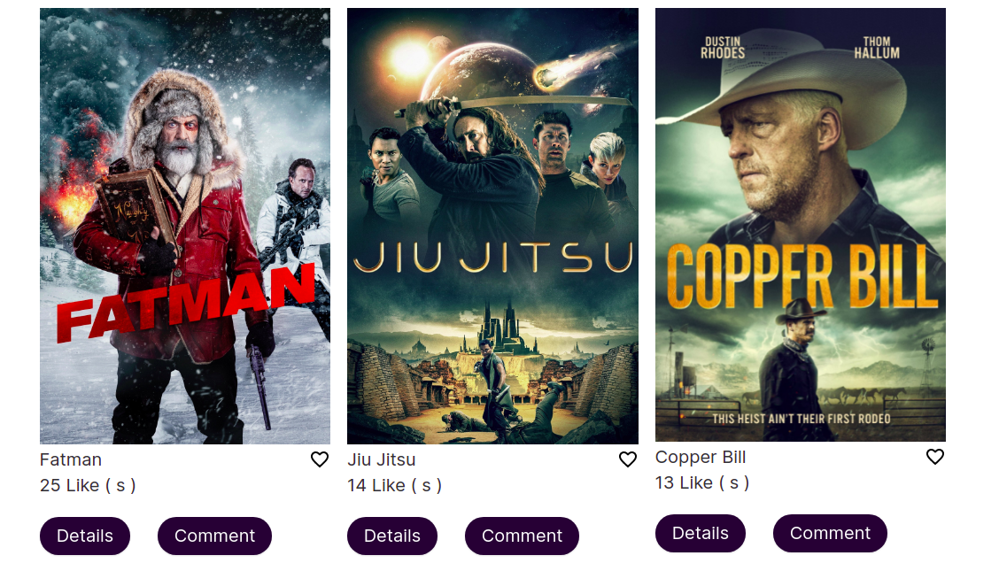
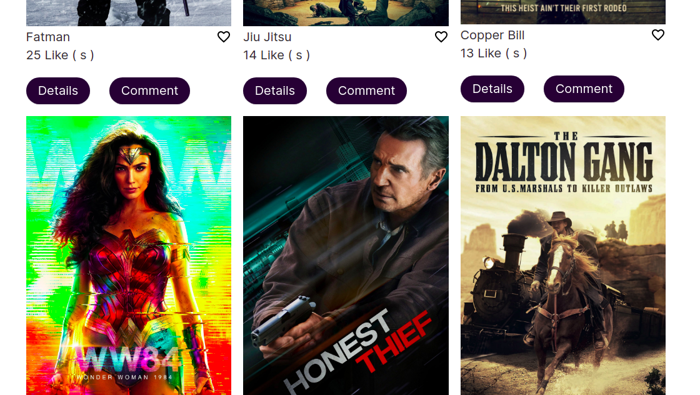

# Moive Hub

> 
The Movie Hub is a website which is based on the Imdb database. It uses Imdb API to fetch Movies with their images and description. With the use of the Involvement API to POST and GET the likes and comments, users can comment and like a certain movie.
> 
# Header

| |
| :------------: |

# Main Section

|  |  |
| :------------: |:------------: |
|  Main Section 1 | Main Section 2

# Footer

|  |
| :------------: |

## Installation

- Clone the repository , use  `git@github.com:Abdona/TheMovieHub.git` 
- open terminal and change Directory, use `cd TheMovieHub`
- Install all Dependencies, use `npm install` or `npm i`

## Usage

### Development server
- to run the Webapp you need to use `npm run start`

You can now view the development server at `localhost:8080`.

# Getting Start with Testing

- open your Terminal and Navigate to the project destination and type `npm install`
- run `npm run test`

## Built With

- HTML
- CSS
- JavaScript
- IMdb API
- Webpack

## Dependencies

### webpack

- [`webpack`](https://github.com/webpack/webpack) - Module and asset bundler.
- [`webpack-cli`](https://github.com/webpack/webpack-cli) - Command line interface for webpack
- [`webpack-dev-server`](https://github.com/webpack/webpack-dev-server) - Development server for webpack
  
### Linters

- [`eslint`](https://github.com/eslint/eslint) - Enforce styleguide across application
- [`eslint-config-airbnb-base`](https://github.com/airbnb/javascript/tree/master/packages/eslint-config-airbnb-base) - Base styleguide to enforce rules

## Acknowledgments

- Microverse

## Author

# 👤 Abdulrahman Naser
- GitHub: [@githubhandle](https://github.com/Abdona)
- LinkedIn: [LinkedIn](https://www.linkedin.com/in/abdulrahman-nasser-2b7173131/)
  
# 👤 Mwila Kaunda
- GitHub: [@githubhandle](https://github.com/softwareengineermwi)
- LinkedIn: [LinkedIn]()

## 🤝 Contributing

Contributions, issues, and feature requests are welcome!

Feel free to check the [issues page](https://github.com/Abdona/TheMovieHub/issues).

## Show your support

Give a ⭐️ if you like this project!

## 📝 License

This project is [MIT]() licensed.
